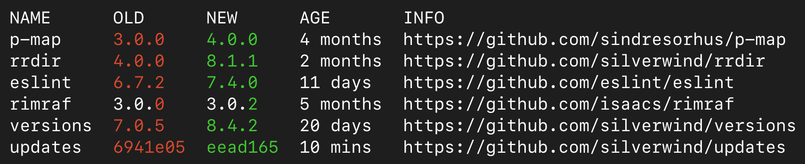

# updates
[](https://www.npmjs.org/package/updates) [](https://www.npmjs.org/package/updates) [](https://packagephobia.com/result?p=updates)



`updates` is a CLI tool which checks for npm dependency updates of the current project and optionally updates `package.json`. It is highly configurable and is typically able to complete in less than a second.

# Usage

```bash
# check for updates
npx updates

# update package.json and install them
npx updates -u && npm i
```

## Bun and Deno

```bash
bunx updates
deno run -A npm:updates
```

## Options

See `--help` or below for the available options. Option that take multiple arguments can take them either via comma-separated value or by specifying the option multiple times. If an option has a optional `pkg` argument but none is given, the option will be applied to all packages instead.

```
usage: updates [options]

  Options:
    -u, --update                       Update versions and write package.json
    -p, --prerelease [<pkg,...>]       Consider prerelease versions
    -R, --release [<pkg,...>]          Only use release versions, may downgrade
    -g, --greatest [<pkg,...>]         Prefer greatest over latest version
    -i, --include <pkg,...>            Include only given packages
    -e, --exclude <pkg,...>            Exclude given packages
    -t, --types <type,...>             Check only given dependency types
    -P, --patch [<pkg,...>]            Consider only up to semver-patch
    -m, --minor [<pkg,...>]            Consider only up to semver-minor
    -d, --allow-downgrade [<pkg,...>]  Allow version downgrades when using latest version
    -E, --error-on-outdated            Exit with code 2 when updates are available and 0 when not
    -U, --error-on-unchanged           Exit with code 0 when updates are available and 2 when not
    -r, --registry <url>               Override npm registry URL
    -G, --githubapi <url>              Override Github API URL
    -f, --file <path>                  Use given package.json file or module directory
    -S, --sockets <num>                Maximum number of parallel HTTP sockets opened. Default: 96
    -j, --json                         Output a JSON object
    -n, --no-color                     Disable color output
    -v, --version                      Print the version
    -V, --verbose                      Print verbose output to stderr
    -h, --help                         Print this help

  Examples:
    $ updates
    $ updates -u && npm i
```

## Config File

Put a `updates.config.js` or `updates.config.mjs` in the root of your project, usually besides `package.json` to configure certain options of the module. CLI arguments have precedence over them.

```js
export default {
  exclude: [
    "versions",
  ],
};
```

### Config Options

- `include` *[]String*: Array of dependencies to include
- `exclude` *[]String*: Array of dependencies to exclude
- `types` *[]String*: Array of dependency types

© [silverwind](https://github.com/silverwind), distributed under BSD licence
