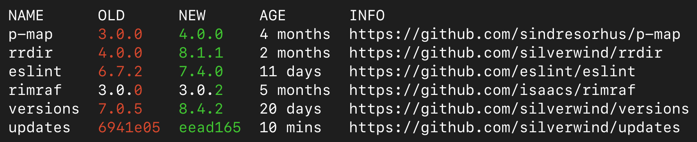

# updates
[](https://www.npmjs.org/package/updates) [](https://www.npmjs.org/package/updates) [](https://packagephobia.com/result?p=updates) [](https://depx.co/pkg/updates)



`updates` is a CLI tool which checks for dependency updates. It is typically able to complete in less than a second.

## Supported files

- `package.json` - npm dependencies
- `pyproject.toml` - uv dependencies
- `go.mod`, `go.work` - go dependencies
- `Cargo.toml` - rust dependencies
- `.{github,gitea,forgejo}/workflows` - actions and docker images
- `Dockerfile*`, `docker-*.{yml,yaml}` - docker images

## Usage

```bash
# check for updates
npx updates

# update package.json and install new dependencies
npx updates -u && npm i
```

## Options

|Option|Description|
|:-|:-|
|`-u, --update`|Update versions and write dependency file|
|`-f, --file <path,...>`|File or directory to use, defaults to current directory|
|`-M, --modes <mode,...>`|Which modes to enable. Either `npm`, `pypi`, `go`, `cargo`, `actions`, `docker`. Default: `npm,pypi,go,cargo,actions,docker`|
|`-i, --include <dep,...>`|Include only given dependencies|
|`-e, --exclude <dep,...>`|Exclude given dependencies|
|`-l, --pin <dep=range>`|Pin dependency to given semver range|
|`-C, --cooldown <duration>`|Minimum dependency age, e.g. `7` (days), `1w`, `2d`, `6h`|
|`-p, --prerelease [<dep,...>]`|Consider prerelease versions|
|`-R, --release [<dep,...>]`|Only use release versions, may downgrade|
|`-g, --greatest [<dep,...>]`|Prefer greatest over latest version|
|`-t, --types <type,...>`|Dependency types to update|
|`-P, --patch [<dep,...>]`|Consider only up to semver-patch|
|`-m, --minor [<dep,...>]`|Consider only up to semver-minor|
|`-d, --allow-downgrade [<dep,...>]`|Allow version downgrades when using latest version|
|`-S, --sockets <num>`|Maximum number of parallel HTTP sockets opened. Default: 96|
|`-T, --timeout <ms>`|Network request timeout in ms (go probes use half). Default: 5000|
|`-r, --registry <url>`|Override npm registry URL|
|`-I, --indirect`|Include indirect Go dependencies|
|`-E, --error-on-outdated`|Exit with code 2 when updates are available and 0 when not|
|`-U, --error-on-unchanged`|Exit with code 0 when updates are available and 2 when not|
|`-j, --json`|Output a JSON object|
|`-x, --no-cache`|Disable HTTP cache|
|`-n, --no-color`|Disable color output|
|`-v, --version`|Print the version|
|`-V, --verbose`|Print verbose output to stderr|
|`-h, --help`|Print the help|

Options that take multiple arguments can take them either via comma-separated value or by specifying the option multiple times. If an option has a optional `dep` argument but none is given, the option will be applied to all dependencies instead. All `dep` options support glob matching via `*` or regex (on CLI, wrap the regex in slashes, e.g. `'/^foo/'`).

## Config File

The module can be configured with `updates.config.{ts,js,mjs,mts}` in your repo root.

```ts
import type {Config} from "updates";

export default {
  exclude: [
    "semver",
    "@vitejs/*",
    /^react(-dom)?$/,
  ],
  pin: {
    "typescript": "^5.0.0",
  },
} satisfies Config;
```

### Config Options

- `include` *Array\<string | RegExp>*: Array of dependencies to include
- `exclude` *Array\<string | RegExp>*: Array of dependencies to exclude
- `types` *Array\<string>*: Array of dependency types to use
- `registry` *string*: URL to npm registry
- `cooldown` *number | string*: Minimum dependency age, e.g. `7` (days), `"1w"`, `"2d"`, `"6h"`
- `pin` *Record\<string, string>*: Pin dependencies to semver ranges
- `files` *Array\<string>*: File or directory paths to use
- `modes` *Array\<string>*: Which modes to enable
- `greatest` *boolean | Array\<string | RegExp>*: Prefer greatest over latest version
- `prerelease` *boolean | Array\<string | RegExp>*: Consider prerelease versions
- `release` *boolean | Array\<string | RegExp>*: Only use release versions
- `patch` *boolean | Array\<string | RegExp>*: Consider only up to semver-patch
- `minor` *boolean | Array\<string | RegExp>*: Consider only up to semver-minor
- `allowDowngrade` *boolean | Array\<string | RegExp>*: Allow version downgrades

CLI arguments have precedence over options in the config file. `include`, `exclude`, and `pin` options are merged.

## API

`updates` can be used as a library:

```ts
import {updates} from "updates";

const output = await updates({
  files: ["package.json"],
  include: [/^react/],
  modes: ["npm"],
});
//=> {
//=>   "results": {
//=>     "npm": {
//=>       "dependencies": {
//=>         "react": {
//=>           "old": "18.0.0",
//=>           "new": "19.2.0",
//=>           "info": "https://github.com/facebook/react",
//=>           "age": "2 days"
//=>         }
//=>       }
//=>     }
//=>   }
//=> }
```

The `updates()` function accepts all [config options](#config-options).

## Environment Variables

|Variable|Description|
|:-|:-|
|`UPDATES_FORGE_TOKENS`|Comma-separated list of `host:token` pairs for authenticating against forge APIs (e.g. `github.com:ghp_xxx,gitea.example.com:tok_xxx`)|
|`UPDATES_GITHUB_API_TOKEN`|GitHub API token for authenticating forge API requests|
|`GITHUB_API_TOKEN`|Fallback GitHub API token|
|`GH_TOKEN`|Fallback GitHub API token|
|`GITHUB_TOKEN`|Fallback GitHub API token|
|`HOMEBREW_GITHUB_API_TOKEN`|Fallback GitHub API token|
|`GOPROXY`|Go module proxy URL. Default: `https://proxy.golang.org,direct`|
|`GONOPROXY`|Comma-separated list of Go module patterns to fetch directly, bypassing the proxy|
|`GOPRIVATE`|Fallback for `GONOPROXY` when not set|

Token resolution order for forge APIs: `UPDATES_FORGE_TOKENS` (matched by hostname) > `UPDATES_GITHUB_API_TOKEN` > `GITHUB_API_TOKEN` > `GH_TOKEN` > `GITHUB_TOKEN` > `HOMEBREW_GITHUB_API_TOKEN`.

© [silverwind](https://github.com/silverwind), distributed under BSD licence
