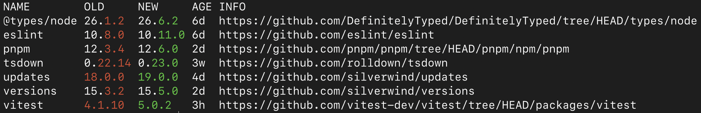

# updates
[](https://www.npmjs.org/package/updates) [](https://www.npmjs.org/package/updates) [](https://packagephobia.com/result?p=updates) [](https://depx.co/pkg/updates)



`updates` is a CLI tool that checks for dependency updates, usually in under a second.

## Supported files

- `package.json`, `pnpm-workspace.yaml` - npm dependencies
- `pyproject.toml` - uv dependencies
- `go.mod`, `go.work` - go dependencies
- `Cargo.toml` - rust dependencies, including workspaces
- `.{github,gitea,forgejo}/workflows` - actions and docker images
- `Dockerfile*`, `compose*.{yml,yaml}`, `docker-*.{yml,yaml}` - docker images
- `Makefile`, `*.mk` - go tool versions in `go install` paths and docker image tags

## Usage

```bash
# check for updates
npx updates

# update package.json and install new dependencies
npx updates -u && npm i
```

## Options

|Option|Description|
|:-|:-|
|`-u, --update`|Update versions and write dependency file|
|`-f, --file <path,...>`|File or directory to use, defaults to current directory|
|`-M, --modes <mode,...>`|Which modes to enable. Either `npm`, `pypi`, `go`, `cargo`, `actions`, `docker`, `make`. Default: all|
|`-i, --include <dep,...>`|Include only given dependencies|
|`-e, --exclude <dep,...>`|Exclude given dependencies|
|`-l, --pin <dep=range>`|Pin dependency to given semver range|
|`-C, --cooldown <duration>`|Minimum dependency age, like `12h`, `7d`, `2w`, `5m` (30 days), `1y` (365 days). A bare number is days|
|`-p, --prerelease [<dep,...>]`|Consider prereleases, implying `--greatest`|
|`-R, --release [<dep,...>]`|Never consider prereleases|
|`-g, --greatest [<dep,...>]`|Ignore the `latest` tag and take the greatest release|
|`-t, --types <type,...>`|Dependency types to update|
|`-P, --patch [<dep,...>]`|Consider only up to semver-patch|
|`-m, --minor [<dep,...>]`|Consider only up to semver-minor|
|`-d, --allow-downgrade [<dep,...>]`|Allow downgrading onto a lower `latest` tag|
|`-s, --sockets <num>`|Maximum number of parallel HTTP sockets opened. Default: 50|
|`-T, --timeout <ms>`|Network request timeout in ms. Default: 5000|
|`-r, --registry <url>`|Override npm registry URL|
|`-I, --indirect`|Include indirect Go dependencies|
|`-E, --error-on-outdated`|Exit with code 2 when updates are available and 0 when not|
|`-U, --error-on-unchanged`|Exit with code 0 when updates are available and 2 when not|
|`-j, --json`|Output a JSON object|
|`-x, --no-cache`|Disable HTTP cache|
|`-c, --color`|Force color output|
|`-n, --no-color`|Disable color output|
|`-v, --version`|Print the version|
|`-V, --verbose`|Print verbose output to stderr|
|`-h, --help`|Print the help|

Options taking multiple arguments accept comma-separated values or repetition. An option with an optional `dep` argument applies to all dependencies when the argument is omitted. `dep` matches globs like `foo*` or regexes wrapped in slashes like `'/^foo/'`, except for `--pin`, which takes an exact name.

A failed lookup is reported on its own, does not hold back the other results and exits with code 1, ahead of `-E` and `-U`. With `-j`, failures are listed in an `errors` array next to `results`.

## Config File

Configure via `updates.config.{ts,js,mjs,mts}`. Each manifest uses the nearest config above it, and workspace members use the workspace root config. CLI arguments win over configured values, including `include`, `exclude` and `pin`.

```ts
import type {Config} from "updates";

export default {
  pin: {
    "typescript": "^6",
  },
} satisfies Config;
```

### Config Options

Mirrors the [CLI options](#options) in camelCase, with `--file` as `files`, plus:

- `overrides` *Array\<Override>*: Per-package option overrides (see [Overrides](#overrides))
- `inherit` *object*: Fields to inherit from other tools' configs (see [Renovate config](#renovate-config))

`include`, `exclude` and the `dep` options take `Array<string | RegExp>`, `pin` takes a `Record<string, string>` keyed by exact dependency name, `files` and `modes` take `Array<string>`.

### Overrides

`overrides` applies options to a subset of dependencies. Each entry takes `include` and/or `exclude` patterns, omit `include` to match all, plus any of `cooldown`, `greatest`, `prerelease`, `release`, `patch`, `minor`, `allowDowngrade`. An override beats the top-level option and the last match wins.

```ts
import type {Config} from "updates";

export default {
  cooldown: "7d",
  overrides: [
    {include: ["@myorg/*"], cooldown: 0},      // no cooldown for your own scope
    {include: [/^@aws-sdk/], cooldown: "14d"}, // longer cooldown for a noisy publisher
    {exclude: ["typescript"], greatest: true}, // greatest for everything but typescript
  ],
} satisfies Config;
```

### Renovate config

A [Renovate](https://docs.renovatebot.com/) `renovate.json` is picked up automatically, inheriting `ignoreDeps`, `enabled` and `allowedVersions` from matching `packageRules` as `include`/`exclude`/`pin`. Exact-name `allowedVersions` ranges become pin ceilings that never downgrade. Configs using `extends` are rejected. `minimumReleaseAge` is not inherited unless opted in:

```ts
export default {
  inherit: {
    renovate: {cooldown: true},
  },
} satisfies Config;
```

Values in `updates.config` override anything inherited.

## API

`updates` can be used as a library and accepts all [config options](#config-options):

```ts
import {updates} from "updates";

const output = await updates({
  files: ["package.json"],
  include: [/^react/],
  modes: ["npm"],
});
//=> {
//=>   "results": {
//=>     "npm": {
//=>       "dependencies": {
//=>         "react": {
//=>           "old": "18.0.0",
//=>           "new": "19.2.0",
//=>           "info": "https://github.com/facebook/react",
//=>           "age": "2d"
//=>         }
//=>       }
//=>     }
//=>   }
//=> }
```

## Environment Variables

|Variable|Description|
|:-|:-|
|`UPDATES_FORGE_TOKENS`|Comma-separated list of `host:token` pairs for forge APIs, e.g. `github.com:ghp_xxx,localhost:3500:tok_xxx`. The host must match the URL exactly, port included|
|`UPDATES_GITHUB_API_TOKEN`|GitHub API token, with `GITHUB_API_TOKEN`, `GH_TOKEN`, `GITHUB_TOKEN` and `HOMEBREW_GITHUB_API_TOKEN` as fallbacks, in that order. Only ever sent to GitHub itself|
|`GOPROXY`|Go module proxy list, honored as go itself does. Default: `https://proxy.golang.org,direct`|
|`GONOPROXY`|Comma-separated list of Go module patterns to fetch directly, bypassing the proxy|
|`GOPRIVATE`|Fallback for `GONOPROXY` when not set|

A host in `UPDATES_FORGE_TOKENS` wins over the GitHub tokens. Any non-GitHub forge without a matching entry receives no credentials.

© [silverwind](https://github.com/silverwind), distributed under BSD licence
